First when you run ng serve  
- starts with main.ts
- goes to app.module.ts
- goes to app.component.ts

        import {Component, OnInit} from '@angular/core'

        @Component({ // contains metadata as well as template to update the view 
            selector:'app-test', //custom html tag that is used to represent this component
            template:`
            <h2>
                Welcome !!
            </h2>
            `,
            styles:[]

        }) // this is a function that attaches to the class below it which is TestComponent
        export class Testcomponent implements OnInit{
            constructor(){}

            ngOnInit(){
                
            }
        }

Command to generate component in angular 

    ng g c test

three ways to declare selectors: 
1. Default
2. Set as class by using . before and mentioning it in a div 

        

3. set as attribute by covering up the selector in []

        
 

## Attributes vs properties 

- Attributes are defined in html and properties are defined in DOM. Attributes initialize DOM properties and then they are done. These values cannot change once they are initialized 

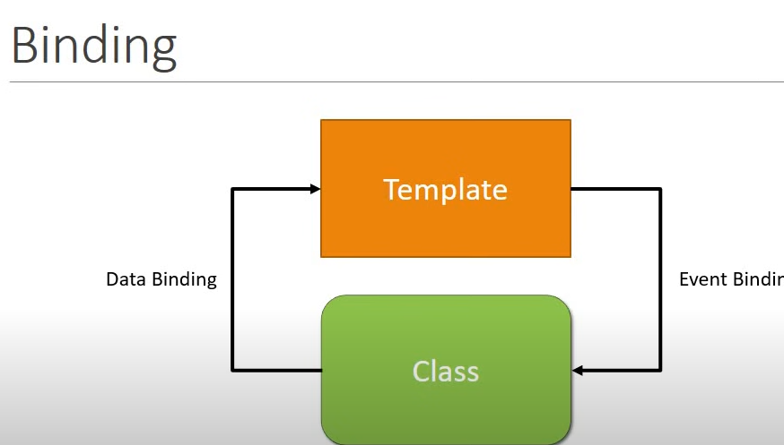
[] - for property binding and () - for event binding.

property binding is class to template 
event binding is template to class

### Attribute Directives
Change the appearance or behaviour of an element.
### Structural Directives 
They allow us to allows us to add or remove html property from the DOM.(Nglf,NgFor,NgSwitch).

## Component Communication 
The parent and child components communicate with each other using *input* and *output* decorators 
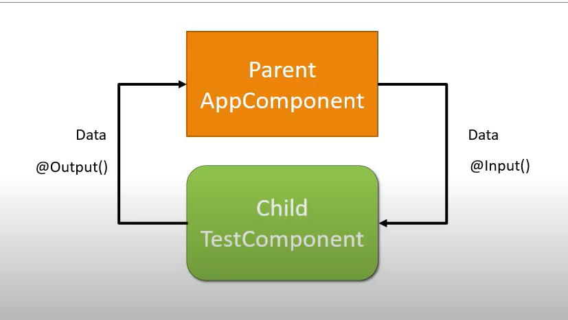

## Pipes

They allow us to transform data before displaying them in view

## Service 
It is a class with a specific purpose 
1. Share data
2. Implement Application logic 
3. External  interaction

Naming cinvention - .service.ts
Services are usingin Angular using Dependency injection 

Dependency injection is a design pattern that helps in being contorl of the code. It is a design pattern that receives its dependencies from external sources rather than creating them itself

When there are multiple dependencies for a class and some dependecies are inturn dependent on each other then managing it becomes difficult. So Angular provides an *injector* where you register all your dependencies. It acts as a container for all the dependencies.

Dependecies are only called services. We register all these services with  the injector. Thus when any component is initialized the injector provides all the necesary dependencies.

### Steps

- Create a service Class
- reister the service class with angular built in injector 
- declare the service as dependency in which it is needed

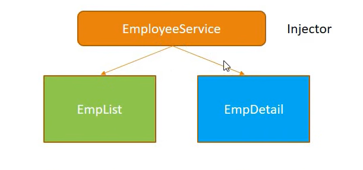

You cannot register the dependency anywhere. Angular has hierarchical Dependency injection system. Only the children of the component or module can use that dependency 

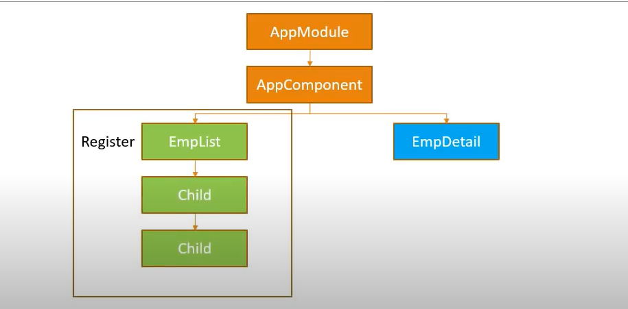
It is better to register the dependency in the app module so all components under uit cn use it. 

Include the service in the providers in the app. 

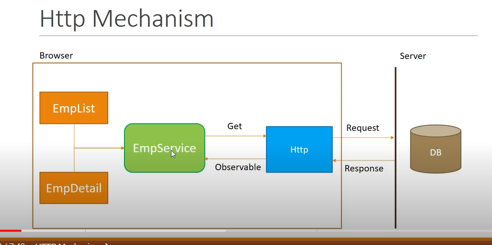
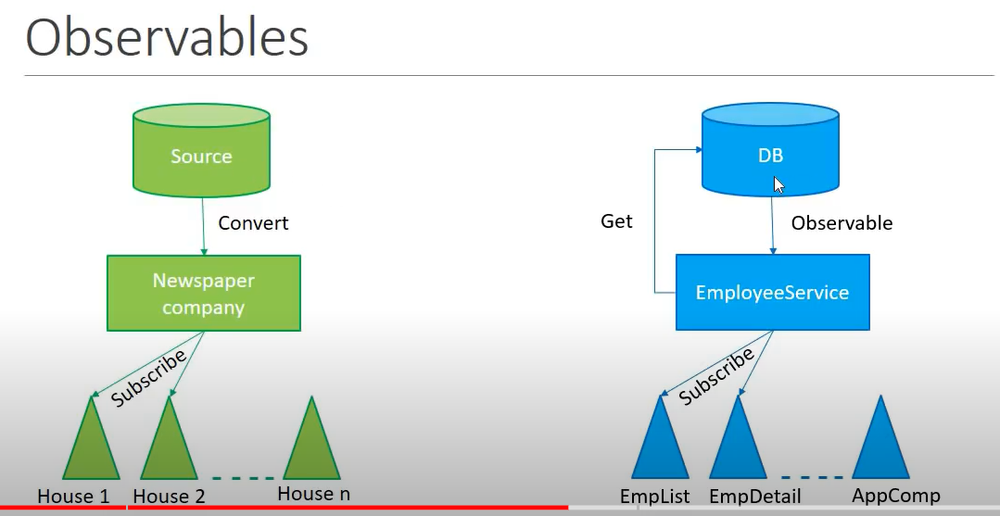

here the response which you get from the http to the service is called an observable. An observable is a sequence of items that arrive asynchronously over time. Indirectly the http response is an observable in angular. the observable is converted into the desired format.

Rxjs is library that helps us to work with observables in angular 

## Relative Navigation
When you use absolute paths as routes they are not flexible when you have a requirement of changing them 

## Lifecycle Hooks 
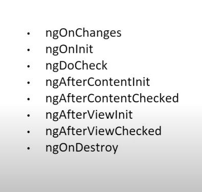
In Angular for every life cycle hook there is an interface. you have to implement the interface if you are trying to access that particular lifecycle hook. Before ngOnInit() the constructor of the component is called.

You also shouldn't implement ngonChanges and ngDoCheck on the same component
ngonchanges - detect any changes to your input values and and docheck will detect any changes inside your application, so it will be like capturing twice. avoid using docheck 

ngAfterViewInit - It is called once after the entire view of the component is fully initialized. It is typically used with @ViewChild or @ViewChildren to reference DOM elements or child components.

    import { Component, AfterViewInit, ViewChild, ElementRef } from '@angular/core';

    @Component({
    selector: 'app-example',
    template: `
        
Content goes here

    `
    })
    export class ExampleComponent implements AfterViewInit {
    @ViewChild('myDiv') myDiv: ElementRef;

    ngAfterViewInit() {
        console.log(this.myDiv.nativeElement.innerHTML);  // Access the div element
    }
    }

In this example, the @ViewChild decorator is used to get a reference to the div element, and the ngAfterViewInit method is used to access and manipulate this element after the view is initialized.

another property of @ViewChild is {static: true}- this means that this component is safe to be used inside onInit of the parent. use it when you need to access the view child in the ngOnInit lifecycle method.

In development mode angular runs change detection twice (kust like react).

Angular has completed one lifecycle check already. So you should use ngAfterViewChecked when you need to execute code after Angular has checked the component's view and its child views for updates. This can be particularly useful for debugging or performing actions that need to occur every time the view is checked, such as recalculating layout or synchronizing view-related data.

         @ViewChild("BStatement", { read: ElementRef }) pStmt: ElementRef;

- ElementRef: Used for direct DOM manipulation and accessing native DOM elements.Provides a direct reference to a native DOM element

        @ViewChild('dynamicContainer', { read: ViewContainerRef }) container: ViewContainerRef;

    
- ViewContainerRef: Used for managing and manipulating view containers, typically for dynamic component loading. Provides methods to create, insert, and remove views dynamically.

## Content Projection

 we use ng-content tag inside the components html and when this compoenent is used somewhere using the selectors even other htmltags work inside this components selector but not for other selectors. 

 The AfterContentInit lifecycle hook is called by angular after the components content has been initialized 

## Http Interceptors
- Allows us to intercept requests
- We can change data nad add headers
- APP_INITIALIZER allows you to inject function as application startup

They are classes that implement the httpInterceptor interface

## Different ways of communication between parent and child component

- Using Input and Output decorators.
- Using the ViewChild injector 
- Using services which are registered as singleton,- i.e only a single instance of them is maintained in the dependency injection chain. All components will receive the same single instance 
- ngrx (Angular Redux)
- Route parameters

## Ngrx

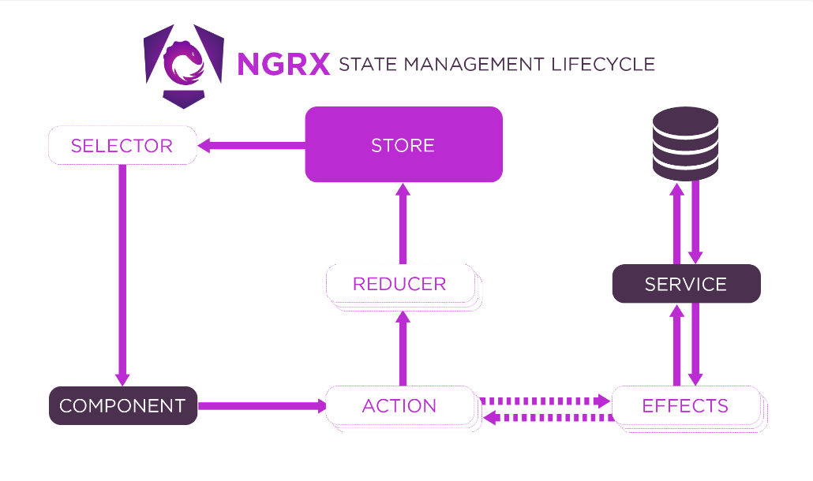

## Angular Forms

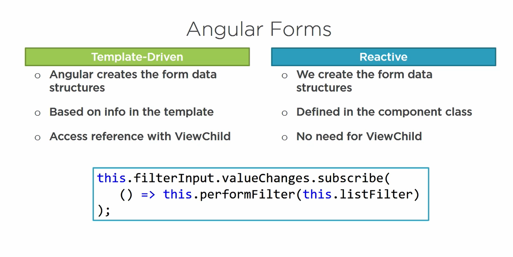
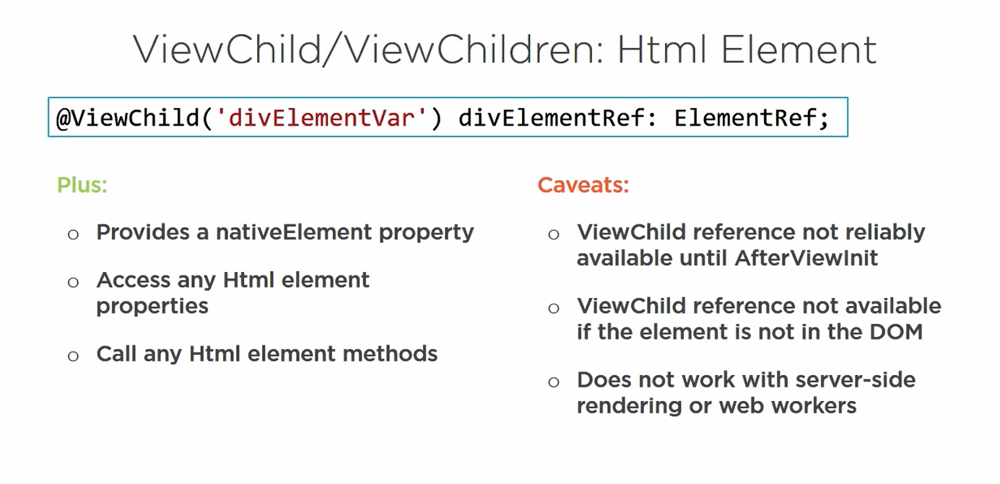
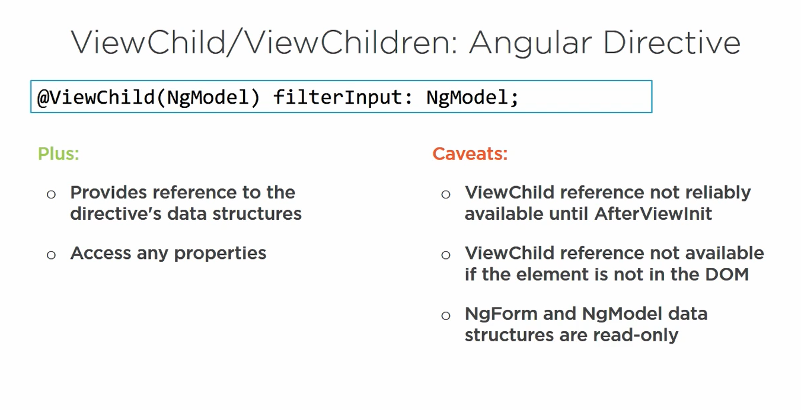

